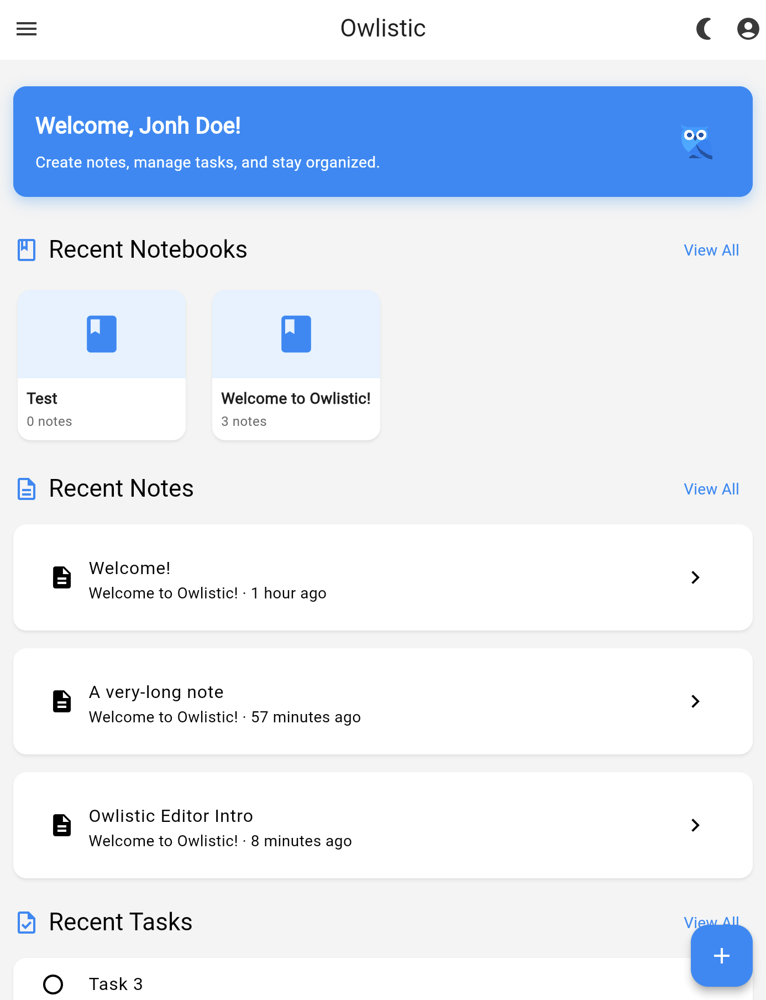

<div align="center">

  
  
  # 🦉 Owlistic AI - Enhanced Fork with Advanced AI Capabilities 🤖🔄⚡️

  > **Fork of [owlistic-notes/owlistic](https://github.com/owlistic-notes/owlistic) with powerful AI enhancements**

  [](https://github.com/owlistic-notes/owlistic)
  [](LICENSE)
  [](https://github.com/anthropics/claude)

</div>

## 🔀 About This Fork

This is an enhanced fork of the original [Owlistic](https://github.com/owlistic-notes/owlistic) project that adds extensive AI capabilities, including agent orchestration, intelligent note processing, and advanced search features. All original features are maintained while adding powerful new AI-driven functionality.

## Table of Contents

- [New AI Features in This Fork](#new-ai-features-in-this-fork)
- [Quick Links](#quick-links)
- [Original Features](#original-features)
- [Screenshots](#screenshots)
- [AI Features (From Original)](#ai-features-from-original)
- [Installation](#install)
- [Contributing](#contributing)
- [License](#license)

## 🚀 New Features in This Fork

This fork adds comprehensive AI capabilities to the original Owlistic project:

### 🤖 AI Integration (All New)
- **AI Dashboard**: Central hub for all AI-powered features
- **AI-Enhanced Notes**: Transform notes with intelligent insights:
  - Smart summaries of note content
  - Automatic extraction of actionable tasks
  - Learning opportunities and knowledge gaps identification
  - AI-powered tagging based on content analysis
  - Related notes discovery through semantic search
- **AI-Powered Task Breakdown**: Convert complex goals into manageable steps
- **Project Planning**: AI-generated project notebooks with structured workflows

### 🔗 Agent Orchestration System (New)
- **Agent Chains**: Create complex workflows by chaining multiple AI agents together
- **Execution Modes**: Sequential, parallel, and conditional agent execution
- **Built-in Agents**:
  - **Reasoning Agent**: Multi-step problem solving with structured thinking
  - **Web Search Agent**: Perplexica integration for advanced web searches
  - **Note Analyzer**: Extract insights and find related notes
  - **Task Planner**: Convert goals into actionable task lists
  - **Code Generator**: Generate code snippets with context
  - **Summarizer**: Create concise summaries of content
- **Dynamic Templates**: Pre-built templates for research, note enhancement, and more
- **Execution Tracking**: Real-time monitoring and history of agent runs

### 🧠 Advanced AI Processing (New)
- **ChromaDB Vector Search**: Semantic search across all notes using embeddings
- **Smart Note Formatting**: Agent outputs formatted as structured blocks, not raw JSON
- **Perplexica Integration**: Advanced web search with focus modes (academic, news, etc.)
- **Configurable Search Depth**: Shallow, medium, and deep search options
- **Background Processing**: Long-running AI tasks without blocking the UI
- **Claude Integration**: Powered by Anthropic's Claude for all AI operations

### 📱 Additional Enhancements
- **Google Calendar Integration**: Sync your tasks and events with Google Calendar
- **Telegram Bot Integration**: Access your notes and AI features via Telegram
- **PWA Support**: Install as Progressive Web App on mobile devices

## Quick Links

- [Installation](https://owlistic-notes.github.io/owlistic/docs/category/installation)
- [Quick Start](https://owlistic-notes.github.io/owlistic/docs/overview/quick-start)
- [FAQ](https://owlistic-notes.github.io/owlistic/docs/troubleshooting/faq)
- [Roadmap](https://owlistic-notes.github.io/owlistic/roadmap)
<!--
- [Api Reference](https://owlistic-notes.github.io/owlistic/docs/category/api-reference)
-->

> [!WARNING]
> Owlistic is still under active development, so you may encounter bugs or breaking changes as we improve.

## Original Features

All features from the original Owlistic project are maintained:

- 📒 Notebooks/Notes tree
- ✏️ Rich (WYSIWYG) editor
- ✔️ Inline todo items
- 🔄 Real-time sync with NATS
- 🔑 JWT-based auth
- 🔒 Role-based access control
- 🗑 Trash
- 🌓 Dark/Light mode
- ⬇️ Import markdown note

Please have a look at the original [features documentation](https://owlistic-notes.github.io/owlistic/docs/category/features) for details.

### Screenshots
<details>
<summary>Show</summary>

### General

| Real Time Updates |
|:---|
|  |

### Editor

| Editor | Scrolling | Toolbar |
|:---|:---|:---|
|  |  |  |

### Screens

| Home | Sidebar | Profile | Trash |
|:---|:---|:---|:---|
|  |  |  |  | 

| Notebooks | Notes | Tasks |
|:---|:---|:---|
|  |  |  |

</details>


## Install

### Prerequisites for AI Features

To use the enhanced AI features in this fork, you'll need:

1. **Anthropic API Key**: Set `ANTHROPIC_API_KEY` environment variable
2. **ChromaDB**: Included in docker-compose for vector search
3. **NATS**: Included in docker-compose for event streaming
4. **Perplexica** (Optional): Set `PERPLEXICA_BASE_URL` for web search
5. **Telegram Bot** (Optional): Set `TELEGRAM_BOT_TOKEN` and `TELEGRAM_CHAT_ID`

### Quick Start with Docker Compose

```bash
# Clone this fork
git clone https://github.com/YOUR_USERNAME/owlistic-ai.git
cd owlistic-ai

# Set up environment variables
export ANTHROPIC_API_KEY="your-api-key"

# Start all services
docker-compose up -d
```

The app will be available at:
- Web UI: `http://localhost`
- API: `http://localhost:8080`

For other installation methods, see the original [installation documentation](https://owlistic-notes.github.io/owlistic/docs/category/installation).

## Contributing

This fork welcomes contributions! When contributing:
- For features specific to this fork, please submit PRs here
- For core Owlistic features, consider contributing to the [original project](https://github.com/owlistic-notes/owlistic)
- Follow the [standard-readme](https://github.com/RichardLitt/standard-readme) specification

## Fork Maintainer

This AI-enhanced fork is maintained by [YOUR_USERNAME].

## Original Contributors

<a href="https://github.com/owlistic-notes/owlistic/graphs/contributors">
  
</a>

## License

This fork maintains the same GPLv3.0 license as the original project.

GPLv3.0 © 2025 owlistic-notes (original project)
GPLv3.0 © 2025 [YOUR_USERNAME] (fork enhancements)
